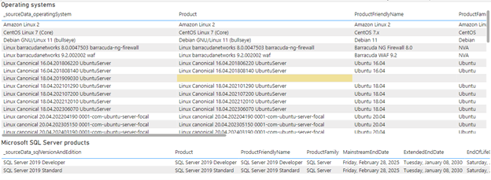
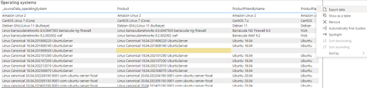
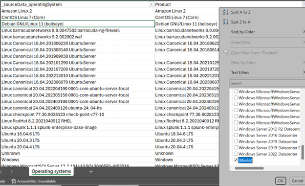
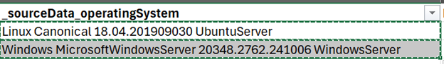
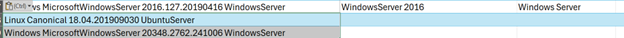
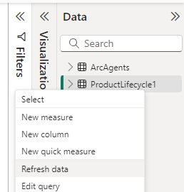

# Customizing the Arc dashboard enrichment metadata

The dashboard uses a Microsoft Excel file named *ProductLifecycle.xlsx* with a table object named *ProductLifecycle1* that contains metadata, cross-referenced with the Azure-retrieved properties.

If the value in the operatingSystem field in the *ArcAgents* dataset isn’t found in the *Product* column of the Excel spreadsheet, then the operating system will be reported as blank in the PowerBI visuals. Likewise, for the Arc-reported SQL Server version and edition.

To resolve these names to user-friendly strings:

1.	On the *_MetadataMaintenance* tab, any missing matches are highlighted in yellow in the two tables. 

2.	Export the respective table to CSV 

3.	Open the CSV file in Excel and filter on the **Product** column for blank values 

4.	Copy the cells from the first column and paste into a new sheet 

5.	Use the Excel **Remove Duplicates** functionality to remove any duplicate rows 
6.	Open in Excel *ProductLifecycle.xlsx*. Copy and paste the rows from the step above to the end of the table 

7.	Fill in at least the **Product friendly name** and **Product family** columns. Save and close *ProductLifecycle.xlsx* when finished.
8.	In PowerBI Desktop, refresh the **ProductLifecycle1** dataset by right clicking and selecting **Refresh data**

9.	The tables should now refresh with the updated metadata and the yellow highlight should disappear.
