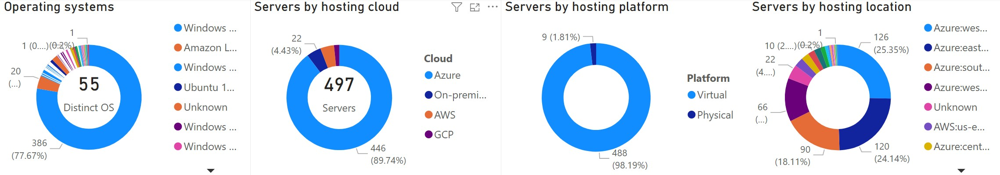
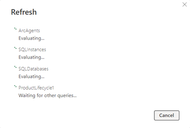

# Adaptive Cloud Situational Awareness Dashboard

Welcome to the Adaptive Cloud Situational Awareness Dashboard repository. This project aims to provide a ready to try PowerBI dashboard for a consolidated view of your Azure-native and Arc-enabled operating systems (Windows and Linux) and SQL databases (IaaS and PaaS) estate. 

The dashboard consists of a single PowerBI template file (ArcDashboard.pbit) and an auxiliary metadata enrichment Excel file (ProductLifecycle.xlsx). The data is retrieved using the built-in PowerBI Azure Resource Graph connector and three KQL queries. 

## Contents
In this file, you will find:
- [Dashboard sample screens](#Sample-screens)
- [Installation instructions](#Installation)
- [Enrichment metadata maintenance](#Metadata-maintenance)
- [KQL data source queries](#KQL-data-source-queries)

## Sample screens
In the sections below you will find sample dashboard screens populated with test environment data.

### Operating system and SQL Server estate
A unified view of all Arc-enabled servers (on-premises and other clouds) and Azure-native virtual machines.


If there are Arc-managed servers that are hosted at AWS or GCP, some of the visuals will reflect that breakdown too:



### Lifecycle Horizons
This report presents a forward view end of extended support dates for operating systems (Windows and Linux) and SQL Server versions. The product lifecycle dates are externalized in the ProductLifecycle.xlsx. A link is included with the source of support dates for each product where such dates have been recorded.

For some Microsoft Windows Server and SQL Server, potential future Extended Security Updates (ESU) costs are estimated based on current public pricing for Windows Server 2012/R2 and SQL Server 2014 (https://azure.microsoft.com/en-us/pricing/details/azure-arc/core-control-plane/#pricing).


### OS Variants
A detailed report of all Arc-enabled and Azure-native servers


### Arc and IaaS SQL Estate
Summary metrics of the entire IaaS SQL estate.


### Arc and IaaS SQL details
A detailed report of all Arc-enabled SQL servers, including various metadata for instance and database.


### Arc SQL Migration Readiness
A unified view of the Arc-enabled SQL servers [Migration Assessment (preview)](https://learn.microsoft.com/en-us/sql/sql-server/azure-arc/migration-assessment) results.


### All SQL Estate
A unified view of all IaaS and PaaS SQL estate (Arc-enabled, Azure SQL Database, Azure SQL Managed Instance).


### All SQL Details
A detailed report of all Arc-enabled SQL servers, Azure SQL Database, and Azure SQL MI including various metadata for instance and database.


### Audit: Azure SQL PaaS Logins
List of users and groups, granted administrator permissions on Azure SQL Database or Azure SQL MI instances.


### Arc agents hygiene
Detailed list of Arc clients with agent version, connectivity status and additional metadata. Primarily aimed at ongoing Arc agents maintenance (version upgrades, connectivity issues resolution, decommissioning.)


## What's new

### March 12, 2025
- Added telemetry and new report for Arc-enabled SQL Migration Assessment (preview) results
- Updated various SQL reports with migration assessment enablement or readiness status
- Updated the "Lifecycle Horizons" report graphs dates and visual styling

## Prerequisites

- PowerBI Desktop installed locally ([Download Microsoft Power BI Desktop from Official Microsoft Download Center](https://www.microsoft.com/en-us/download/details.aspx?id=58494))
- Azure RBAC read permissions on the following resource types:
    - Microsoft.HybridCompute/machines
    - Microsoft.Compute/virtualmachines
    - Microsoft.AzureArcData/sqlserverinstances
    - Microsoft.AzureArcData/sqlserverinstances/databases
    - Microsoft.Sql/servers
    - Microsoft.Sql/servers/databases
    - Microsoft.Sql/managedinstances
    - Microsoft.Sql/managedInstances/databases
    - Microsoft.SqlVirtualMachine/sqlVirtualMachines

## Known issues
None for the last release.

## Installation

1. Dowload [ArcDashboard.pbit](ArcDashboard.pbit) and [ProductLifecycle.xlsx](ProductLifecycle.xlsx) and save to local folder **C:\ArcDashboard**.
> [!NOTE]
> If saving to a different folder path, follow the instructions further down to modify the PowerBI report data source path for ProductLifecycle.xlsx

2. Open the file **ArcDashboard.pbit**. Wait for PowerBI Desktop to load and begin refreshing data. When the authentication prompt pops up, click **Sign in**. Follow one of the two procedures below, depending on whether you are authenticating to the current or alternative Entra ID tenant.<br/>


    <details>
        <summary>Authenticate with the user's current credentials and Entra ID tenant</summary>
            1. In the authentication prompt, click on your logged in account<br/>
            <br/>
            2. After the authentication process completes, click <b>Connect</b><br/>
            <br/>
    </details>
    <details>
        <summary>Authenticate with alternate credentials/Entra ID tenant</summary>
            1. In the authentication prompt, click on <b>Use another account</b><br/>
            <br/>
            2. Click <b>Sign-in options</b><br/>
            <br/>
            3. Click <b>Sign in to an organization</b><br/>
            <br/>
            4. Type in the Entra ID tenant domain name and click <b>Next</b><br/>
            <br/>
            <br/>
            5. Click <b>Use another account</b>, enter your credentials and complete the authentication process<br/>
           <br/>
            6. After the authentication process completes, click <b>Connect</b>
           <br/>
    </details>

3. The datasets should start refreshing now. Depending on the number of Azure virtual machines, Azure SQL Database, Azure SQL Managed Instance, and Arc-managed servers, this might take a while.<br/>

4. When completed, the dashboard visuals will refresh with your environment data.<br/>
5. Finally, save the report as a PowerBI .pbix file. The query results data is persisted in the file so you can share with others who do not have direct Azure permissions to refresh the data.

## Metadata maintenance
Refer to the instructions in [MetadataMaintenance.md](MetadataMaintenance.md)

## KQL data source queries
The PowerBI report uses the following base Kusto queries. Some of the returned properties are further expanded in the PowerBI query model.

### ArcAgents
Retrieves a list of all Arc-enabled machines and Azure-native virtual machines.

```
resources
| where type == 'microsoft.hybridcompute/machines' or type == 'microsoft.compute/virtualmachines'
| extend arcAgentVersion = tostring(properties.agentVersion)
| extend arcWsEsuStatus = properties.licenseProfile.esuProfile.licenseAssignmentState 
| extend cloud = iif(type == 'microsoft.compute/virtualmachines',"Azure",iif(tostring(properties.cloudMetadata.provider) == "N/A" or tostring(properties.cloudMetadata.provider) == "", "On-premises", tostring(properties.cloudMetadata.provider)))
| extend isVirtual = iff(properties.detectedProperties.model == "Virtual Machine" or properties.detectedProperties.manufacturer == "VMware, Inc." or properties.detectedProperties.manufacturer == "Nutanix" or properties.cloudMetadata.provider == "AWS" or properties.cloudMetadata.provider == "GCP" or type == 'microsoft.compute/virtualmachines', true, false)
| extend model = iif(cloud == "Azure","Virtual Machine",tostring(properties.detectedProperties.model))
| extend manufacturer = iif(cloud == "Azure","Microsoft Corporation",tostring(properties.detectedProperties.manufacturer))
| extend cpuTotalCores = iif(type == 'microsoft.compute/virtualmachines', toint(extract(@"(\d+)",0,extract(@"_(\D+)(\d+)_*",0,tostring(properties.hardwareProfile.vmSize)))),toint(properties.detectedProperties.logicalCoreCount))
| extend operatingSystem = iif(type == 'microsoft.compute/virtualmachines', strcat(properties.storageProfile.osDisk.osType," ",iif(isnotempty(properties.storageProfile.imageReference.sku),strcat(properties.storageProfile.imageReference.publisher," ",iif(properties.storageProfile.imageReference.publisher == 'MicrosoftWindowsServer',extract(@"^(\d+)",0,tostring(properties.storageProfile.imageReference.exactVersion)),extract(@"^(\d+).(\d+)",0,tostring(properties.storageProfile.imageReference.exactVersion)))," ",properties.storageProfile.imageReference.offer),properties.storageProfile.imageReference.sku)),tostring(properties.osSku))
| extend operatingSystem = iff(type == 'microsoft.compute/virtualmachines' and properties.licenseType == 'Windows_Client',properties.extended.instanceView.osName,operatingSystem)
| extend operatingSystem = iif(isempty(operatingSystem),"Unknown",operatingSystem)
| extend isWindowsServer = iff(tolower(operatingSystem) has "windows server" or tolower(operatingSystem) has "windowsserver",true,false)
| extend isWsPhysicalDc = iff(properties.osSku has "Server 2012" and properties.osSku has "Datacenter" and isVirtual == "Physical",bool(true),bool(false))
| project name,cpuTotalCores,isVirtual,azureResourceGroup=resourceGroup,arcWsEsuStatus,operatingSystem,model,manufacturer,cloud,properties,isWindowsServer,isWsPhysicalDc,tags,id,location,subscriptionId
```

### SQLAll
Retrieves all Arc-enabled SQL instances, Azure SQL IaaS extension virtual machines, Azure SQL Database, and Azure SQL Managed Instance resources.

```
resources
| where type =~ 'Microsoft.Sql/servers' or type == 'microsoft.azurearcdata/sqlserverinstances' or type == 'microsoft.sql/managedinstances' or type == 'Microsoft.SqlVirtualMachine/sqlVirtualMachines'
| extend sqlVersion = properties.version, sqlEdition=properties.edition, bpa = iff(notnull(properties.settings.AssessmentSettings),"Enabled","Disabled")
| extend arcMachineName = iff(type == 'microsoft.azurearcdata/sqlserverinstances' or type == 'Microsoft.SqlVirtualMachine/sqlVirtualMachines',iff(indexof(name,"_") <= 0,name,substring(name,0,indexof(name,"_"))),'Not applicable')
| extend sqlVersion = iff(type == 'microsoft.sql/managedinstances',strcat(sku.name,"-",sku.tier),sqlVersion)
```

### SQLAllDatabases
Retrieves all databases associated with Arc-enabled SQL servers, Azure SQL Database, and Azure SQL Managemed Instance resources.

```
resources
| where  type =~ "microsoft.azurearcdata/sqlserverinstances/databases" or type =~ "microsoft.sql/managedInstances/databases" or type =~ "microsoft.sql/servers/databases"
| extend sqlInstanceName = tostring(split(tostring(id),"/")[8]), sqlInstanceId = substring(id,0,indexof(tolower(id),"/databases"))
| extend parentSqlResourceId = substring(id,0,indexof(tolower(id),"/databases"))
| extend reverseParentSqlResId = reverse(parentSqlResourceId)
| extend parentSqlResourceName = reverse(substring(reverseParentSqlResId,0,indexof(reverseParentSqlResId,"/")))
| extend arcMachineName = iff(type =~ "microsoft.azurearcdata/sqlserverinstances/databases" or type == 'Microsoft.SqlVirtualMachine/sqlVirtualMachines',iff(indexof(sqlInstanceName,"_") <= 0,sqlInstanceName,substring(sqlInstanceName,0,indexof(sqlInstanceName,"_"))),"Not applicable")
| project-away reverseParentSqlResId
```
