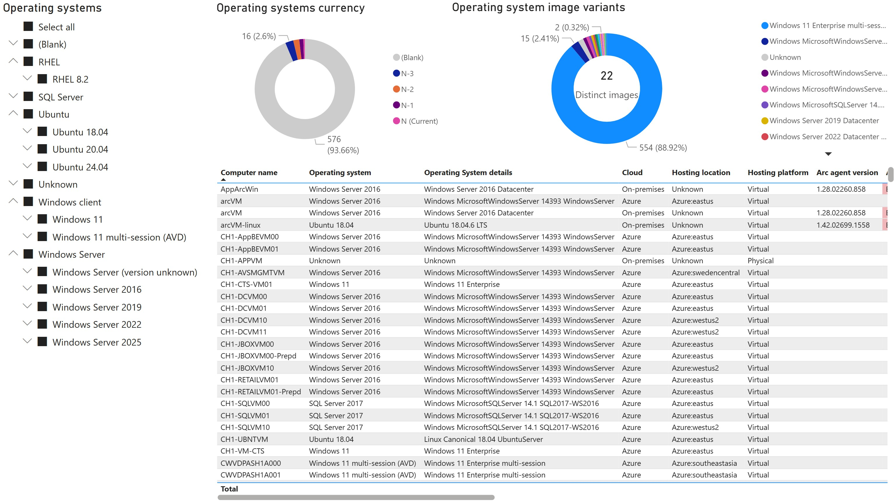

# Adaptive Cloud Situational Awareness Dashboard

Welcome to the Adaptive Cloud Situational Awareness Dashboard repository. This project aims to provide a ready to try PowerBI dashboard for a consolidated view of your Azure-native and Arc-enabled operating systems (Windows and Linux) and SQL databases (IaaS and PaaS) estate. 

The dashboard consists of a single PowerBI template file (ArcDashboard.pbit) and an auxiliary metadata enrichment Excel file (ProductLifecycle.xlsx). The data is retrieved using the built-in PowerBI Azure Resource Graph connector and three KQL queries. 

## Contents
In this file, you will find:
- [Dashboard sample screens](#Sample-screens)
- [Installation instructions](#Installation)
- [Enrichment metadata maintenance](#Metadata-maintenance)

## Sample screens
In the sections below you will find sample dashboard screens populated with test environment data.

### Operating system and SQL Server estate
A unified view of all Arc-enabled servers (on-premises and other clouds) and Azure-native virtual machines.

### Lifecycle Horizons
This report presents a forward view end of extended support dates for operating systems (Windows and Linux) and SQL Server versions. The product lifecycle dates are externalized in the ProductLifecycle.xlsx. A link is included with the source of support dates for each product where such dates have been recorded.

For Microsoft Windows and SQL Server, Extended Security Updates (ESU) costs are estimated based on current public pricing (for Windows and SQL Server versions currently under ESU) and assumed >>>

### OS Variants
A detailed report of all Arc-enabled and Azure-native servers

### Arc and IaaS SQL Estate
Summary metrics of the entire IaaS SQL estate.

### Arc and IaaS SQL details
A detailed report of all Arc-enabled SQL servers, including various metadata for instance and database.

### Arc SQL Migration Readiness
A unified view of the Arc-enabled SQL servers [Migration Assessment (preview)](https://learn.microsoft.com/en-us/sql/sql-server/azure-arc/migration-assessment) results.

### All SQL Estate
A unified view of all IaaS and PaaS SQL estate (Arc-enabled, Azure SQL Database, Azure SQL Managed Instance).

### All SQL Details
A detailed report of all Arc-enabled SQL servers, Azure SQL Database, and Azure SQL MI including various metadata for instance and database.

### Audit: Azure SQL PaaS Logins
List of users and groups, granted administrator permissions on Azure SQL Database or Azure SQL MI instances.

### Arc agents hygiene
Detailed list of Arc clients with agent version, connectivity status and additional metadata. Primarily aimed at ongoing Arc agents maintenance (version upgrades, connectivity issues resolution, decommissioning.)

## What's new

### March 12, 2025
- Added telemetry and new report for Arc-enabled SQL Migration Assessment (preview) results
- Updated various SQL reports with migration assessment enablement or readiness status
- Updated the "Lifecycle Horizons" report graphs dates and visual styling

## Prerequisites

- PowerBI Desktop installed locally ([Download Microsoft Power BI Desktop from Official Microsoft Download Center](https://www.microsoft.com/en-us/download/details.aspx?id=58494))
- Azure RBAC read permissions on the following resource types:
    - Microsoft.HybridCompute/machines
    - Microsoft.Compute/virtualmachines
    - Microsoft.AzureArcData/sqlserverinstances
    - Microsoft.AzureArcData/sqlserverinstances/databases
    - Microsoft.Sql/servers
    - Microsoft.Sql/servers/databases
    - Microsoft.Sql/managedinstances
    - Microsoft.Sql/managedInstances/databases
    - Microsoft.SqlVirtualMachine/sqlVirtualMachines

## Known issues
None for the last release.

## Installation

1. Dowload ArcDashboard.pbit and ProductLifecycle.xlsx and save to local folder C:\ArcDashboard.
> [!NOTE]
> If saving to a different folder path, follow the instructions further down to modify the PowerBI report data source path for ProductLifecycle.xlsx

2. Open the file ArcDashboard.pbit. Wait for PowerBI Desktop to load and begin refreshing data. When the authentication prompt pops up, click **Sign in**. Follow one of the two procedures below, depending on whether you are authenticating to the current or alternative Entra ID tenant.

    

        
Authenticate with the user's current credentials and Entra ID tenant

            1. In the authentication prompt, click on your logged in account 
            2. After the authentication process completes, click "Connect"
    

    

        
Authenticate with alternate credentials/Entra ID tenant

            1. In the authentication prompt, click on "Use another account" 
            2. Click "Sign-in options" 
            3. Click "Sign in to an organization" 
            4. Type in the Entra ID tenant domain name and click "Next" 
            5. Click "Use another account", enter your credentials and complete the authentication process 
            6. After the authentication process completes, click "Connect"
    

4. The datasets should start refreshing now. Depending on the number of Azure virtual machines, Azure SQL Database, Azure SQL Managed Instance, and Arc-managed servers, this might take a while. 
5. When completed, the dashboard visuals will refresh with your environment data. 
6. Finally, save the report as a PowerBI .pbix file. The query results data is persisted in the file so you can share with others who do not have direct Azure permissions to refresh the data.

## Metadata maintenance
Refer to the instructions in [MetadataMaintenance.md](MetadataMaintenance.md)
